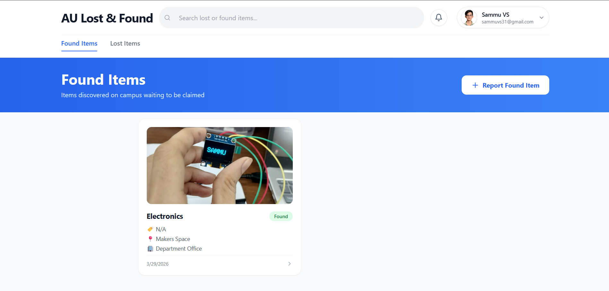
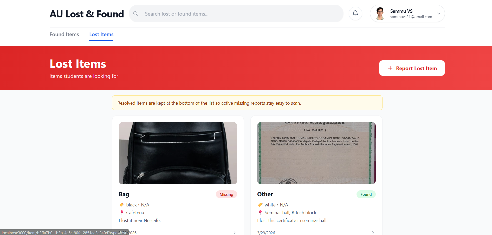
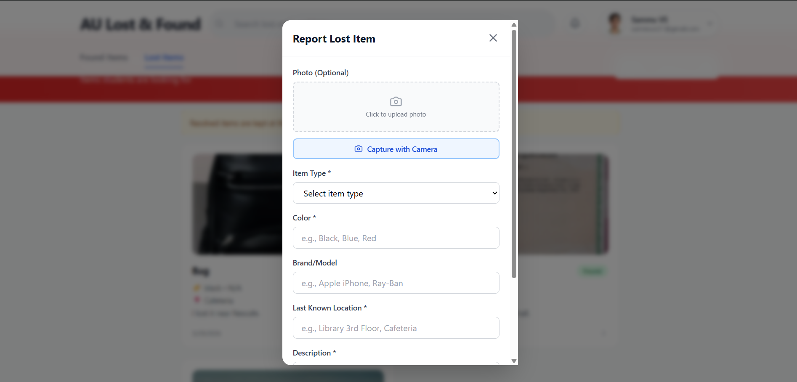

# AU Lost & Found

🚀 AU Lost & Found is a smart campus platform that helps students quickly report, discover, and recover lost items in a simple and secure way.

It gives colleges one clear place for lost and found activity, making it easier for students to reconnect with their belongings faster.

## 📸 Screenshots





## 🎯 Features

### Core Functionality

- **Found Items Management**: Post items found on campus with photo, type, location, and donation details
- **Lost Items Reporting**: Report missing items with detailed descriptions
- **Smart Search**: Context-aware search that filters based on current page
- **"Is Found?" System**: When a finder locates a lost item, they can report its current location
- **Mobile-First Design**: Beautiful, responsive UI optimized for mobile with graceful desktop scaling

### UI/UX Highlights

- Sticky header with search bar
- Fixed bottom navigation (mobile) with three main sections: Found, Lost, Profile
- Clean card-based layout with Lucide React icons
- Smooth animations and modern styling with Tailwind CSS

## 🛠️ Tech Stack

- **Framework**: Next.js 15 (App Router)
- **Language**: TypeScript
- **Styling**: Tailwind CSS
- **Icons**: Lucide React
- **Database**: Supabase (PostgreSQL)
- **State Management**: React Hooks

## 📋 Database Schema

### Tables

#### `found_items`

Items that have been found on campus.

| Column         | Type      | Description                                                                                      |
| -------------- | --------- | ------------------------------------------------------------------------------------------------ |
| id             | UUID      | Primary key                                                                                      |
| photo_url      | TEXT      | URL to uploaded image                                                                            |
| item_type      | ENUM      | Type of item (Wallet, Eyeglasses, Keys, Bag, ID Card, Electronics, Other)                        |
| brand_color    | TEXT      | Brand/Color description                                                                          |
| location_found | TEXT      | Where the item was found                                                                         |
| handed_over_to | ENUM      | Location where item is held (Director's Office, Security Desk, Department Office, Hostel Warden) |
| created_at     | TIMESTAMP | When item was recorded                                                                           |
| created_by     | TEXT      | User identifier                                                                                  |

#### `lost_items`

Items that students are looking for.

| Column        | Type      | Description                          |
| ------------- | --------- | ------------------------------------ |
| id            | UUID      | Primary key                          |
| item_type     | ENUM      | Type of item                         |
| color         | TEXT      | Color of the lost item               |
| brand         | TEXT      | Brand/Model                          |
| location_lost | TEXT      | Last known location                  |
| description   | TEXT      | Detailed description                 |
| status        | ENUM      | Current status: 'Missing' or 'Found' |
| created_at    | TIMESTAMP | When item was reported               |
| created_by    | TEXT      | User identifier                      |

#### `found_comments`

Records when a lost item is located via the "Is Found?" feature.

| Column           | Type      | Description                                                                |
| ---------------- | --------- | -------------------------------------------------------------------------- |
| id               | UUID      | Primary key                                                                |
| lost_item_id     | UUID      | Reference to lost_items                                                    |
| who_has_it       | ENUM      | Who currently has the item (Student, Professor/Faculty, Cleaner, Security) |
| current_location | TEXT      | Current location details                                                   |
| found_date       | TIMESTAMP | When item was found                                                        |
| created_by       | TEXT      | Finder's identifier                                                        |

## 🚀 Getting Started

### Prerequisites

- Node.js 18+ and npm
- Supabase account

### 1. Install Dependencies

```bash
npm install
```

### 2. Set Up Supabase

#### Create Tables

Execute the following SQL in your Supabase dashboard:

```sql
-- Create enum types
CREATE TYPE item_type AS ENUM ('Wallet', 'Eyeglasses', 'Keys', 'Bag', 'ID Card', 'Electronics', 'Other');
CREATE TYPE handed_over_to_enum AS ENUM ('Director''s Office', 'Security Desk', 'Department Office', 'Hostel Warden');
CREATE TYPE who_has_it_enum AS ENUM ('Student', 'Professor/Faculty', 'Cleaner', 'Security');
CREATE TYPE item_status AS ENUM ('Missing', 'Found');

-- Create found_items table
CREATE TABLE found_items (
  id UUID PRIMARY KEY DEFAULT gen_random_uuid(),
  photo_url TEXT,
  item_type item_type NOT NULL,
  brand_color TEXT NOT NULL,
  location_found TEXT NOT NULL,
  handed_over_to handed_over_to_enum NOT NULL,
  created_at TIMESTAMP WITH TIME ZONE DEFAULT CURRENT_TIMESTAMP,
  created_by TEXT
);

-- Create lost_items table
CREATE TABLE lost_items (
  id UUID PRIMARY KEY DEFAULT gen_random_uuid(),
  item_type item_type NOT NULL,
  color TEXT NOT NULL,
  brand TEXT,
  location_lost TEXT NOT NULL,
  description TEXT NOT NULL,
  status item_status DEFAULT 'Missing',
  created_at TIMESTAMP WITH TIME ZONE DEFAULT CURRENT_TIMESTAMP,
  created_by TEXT NOT NULL
);

-- Create found_comments table
CREATE TABLE found_comments (
  id UUID PRIMARY KEY DEFAULT gen_random_uuid(),
  lost_item_id UUID NOT NULL REFERENCES lost_items(id) ON DELETE CASCADE,
  who_has_it who_has_it_enum NOT NULL,
  current_location TEXT NOT NULL,
  found_date TIMESTAMP WITH TIME ZONE DEFAULT CURRENT_TIMESTAMP,
  created_by TEXT NOT NULL
);

-- Create indexes for better query performance
CREATE INDEX idx_found_items_created_at ON found_items(created_at DESC);
CREATE INDEX idx_lost_items_created_at ON lost_items(created_at DESC);
CREATE INDEX idx_lost_items_status ON lost_items(status);
CREATE INDEX idx_found_comments_lost_item_id ON found_comments(lost_item_id);
```

#### Create Storage Bucket

1. Go to Storage → Buckets
2. Create a new bucket named `lost-found-photos`
3. Set it to Public
4. Update policies to allow public reads and authenticated writes

### 3. Set Environment Variables

Create a `.env.local` file in the project root:

```env
NEXT_PUBLIC_SUPABASE_URL=your_supabase_url_here
NEXT_PUBLIC_SUPABASE_ANON_KEY=your_supabase_anon_key_here
```

Get these values from your Supabase project settings (API → Project API keys).

### 4. Run Development Server

```bash
npm run dev
```

Open [http://localhost:3000](http://localhost:3000) in your browser.

## 📁 Project Structure

```
src/
├── app/
│   ├── layout.tsx                 # Root layout with header & bottom nav
│   ├── globals.css                # Global Tailwind styles
│   ├── page.tsx                   # Found Items (home)
│   ├── lost/
│   │   └── page.tsx              # Lost Items page
│   ├── item/
│   │   └── [id]/
│   │       └── page.tsx          # Item detail view
│   └── profile/
│       └── page.tsx              # User profile
├── components/
│   ├── Header.tsx                 # Sticky header with logo
│   ├── BottomNav.tsx             # Mobile bottom navigation
│   ├── SearchBar.tsx             # Context-aware search
│   ├── ItemCard.tsx              # Item list card component
│   ├── ItemDetailView.tsx        # Lost item detail with "Is Found?" form
│   ├── AddFoundItemForm.tsx      # Form to post found items
│   └── AddLostItemForm.tsx       # Form to post lost items
└── lib/
    ├── supabase.ts               # Supabase client initialization
    └── types.ts                  # TypeScript interfaces & types
```

## 🔄 Key Workflows

### Posting a Found Item

1. User clicks "Report Found Item" button on home page
2. Fills form with: Photo, Item Type, Brand/Color, Location Found, Handed Over To
3. Form submits to `found_items` table
4. Item appears in Found Items list

### Reporting a Lost Item

1. User clicks "Report Lost Item" on Lost Items page
2. Fills form with: Item Type, Color, Brand, Location Lost, Description
3. Form submits to `lost_items` table with status = "Missing"
4. Item appears in Lost Items list

### The "Is Found?" Workflow

1. **Finder sees lost item** in the Lost Items page
2. **Clicks "I Found This Item!"** button
3. **Form appears asking**:
   - Who currently has it? (Dropdown)
   - Where is it located? (Text area)
4. **Form submits**, which:
   - Creates entry in `found_comments` table
   - Updates `lost_items.status` to "Found"
   - Original owner sees success message with location details

### Context-Aware Search

- Search bar on Found Items page filters: `item_type`, `brand_color`, `location_found`, `handed_over_to`
- Search bar on Lost Items page filters: `item_type`, `color`, `brand`, `location_lost`, `description`
- Search is real-time and case-insensitive

## 🎨 Design System

### Colors

- **Primary**: Blue (#3b82f6)
- **Secondary**: Orange (for Lost items)
- **Success**: Green (for Found items)
- **Background**: Light gray (#fafafa)

### Typography

- **Headings**: Bold, large (3xl-4xl)
- **Body**: Regular gray text
- **Small Text**: Gray-600, xs-sm sizes

### Components

- **Cards**: Rounded 2xl, shadow-sm, border
- **Buttons**: Rounded lg-xl, full-width on mobile
- **Forms**: Clean inputs with focus rings
- **Modals**: Slide up from bottom on mobile, centered on desktop

## 🚢 Deployment

### Vercel (Recommended)

1. Push to GitHub
2. Connect to Vercel
3. Add environment variables in Vercel dashboard
4. Deploy!

### Other Platforms

Update `next.config.js` as needed and follow their deployment guides.

## 🧪 Testing

The application includes error handling and validation:

- Form validation before submission
- Database error handling
- Network error management
- Graceful loading and error states

## 📝 Data Logic & Business Rules

1. **Found Items**: Status is always "Found" by default
2. **Lost Items**:
   - Default status is "Missing"
   - Status changes to "Found" only when someone uses "Is Found?" feature
3. **Found Comments**: Can only exist for Lost Items
4. **Search**: Case-insensitive, searches multiple fields
5. **User Identity**: Currently uses "anonymous" placeholder (integrate with auth in production)

## 🔒 Security Considerations

For production:

- Implement user authentication (Supabase Auth)
- Add rate limiting to prevent spam
- Validate all file uploads (size, type)
- Implement CORS policies
- Add input sanitization
- Use environment variables for sensitive data

## 🐛 Troubleshooting

### Items not loading?

- Check Supabase credentials in `.env.local`
- Verify database connection
- Check browser console for errors

### Photo upload failing?

- Verify storage bucket exists and is public
- Check file size limits
- Verify CORS settings in Supabase

### "Is Found?" not working?

- Ensure `found_comments` table exists
- Check lost item ID is correct
- Verify foreign key relationship

## 📚 Next Steps (for SaaS Scaling)

- User authentication & profiles
- Notification system (when item is found)
- Messaging between users
- Item categories & advanced filters
- Analytics dashboard
- Admin moderation tools
- Mobile app (React Native)
- Map integration (show item locations)
- QR codes for items
- Social features (ratings, reviews)

## 📄 License

MIT License - feel free to use this for your hackathon!

## 👥 Support

For issues or questions, check the code comments or reach out to the development team.

---

**Built with ❤️ for Campus Communities**
